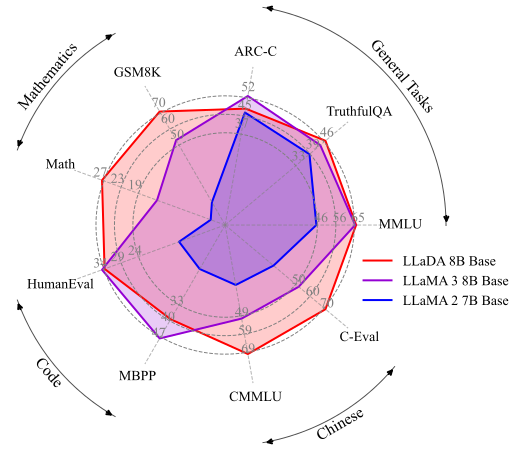
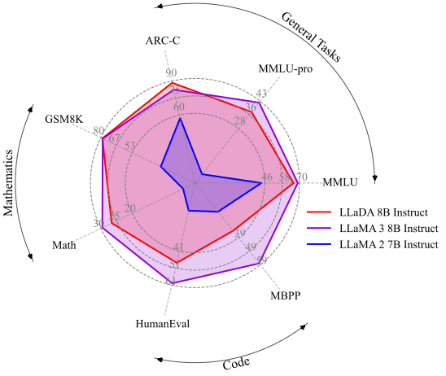

**Student:** Yewon Lim
**Student ID:** 2019145010
**University:** Yonsei University

# Large Language Diffusion Models

[](https://arxiv.org/abs/2502.09992)
[](https://huggingface.co/GSAI-ML/LLaDA-8B-Base)
[](https://huggingface.co/GSAI-ML/LLaDA-8B-Instruct)
[](https://huggingface.co/spaces/multimodalart/LLaDA)

We introduce LLaDA (**L**arge **La**nguage **D**iffusion with m**A**sking), a diffusion model with an unprecedented 8B scale, trained entirely from scratch, rivaling LLaMA3 8B in performance.

<div style="display: flex; justify-content: center; flex-wrap: wrap;">
    
    
</div>

---

## News
- **[2024.05]** We have provided evaluation code based on the [lm-evaluation-harness](https://github.com/EleutherAI/lm-evaluation-harness) for LLaDA-Base.
- **[2024.02]** We have uploaded our paper to [arXiv](https://arxiv.org/abs/2502.09992) and open-sourced [LLaDA-8B-Base](https://huggingface.co/GSAI-ML/LLaDA-8B-Base) and [LLaDA-8B-Instruct](https://huggingface.co/GSAI-ML/LLaDA-8B-Instruct).

---

## LLaDA Training

### 1. Environment Setup

#### 1.1 Docker Container

1. Pull and run the Docker image with GPU support:

   ```bash
   docker pull pytorch/pytorch:2.5.0-cuda12.4-cudnn9-devel
   docker run --gpus all -it \
     -v $(pwd):/workspace/LLaDA \
     --workdir /workspace/LLaDA \
     pytorch/pytorch:2.5.0-cuda12.4-cudnn9-devel bash
   ```

2. Inside the container, create and activate a Python virtual environment:

   ```bash
   python3 -m venv .venv
   source .venv/bin/activate
   ```

3. Install project dependencies and synchronize:

   ```bash
   pip install uv
   uv sync
   ```

---

### 2. Training Script (`train.sh`)

The training is orchestrated by `train.sh`. It utilizes `torchrun` for distributed training across 8 GPUs on a single node.

```bash
#!/bin/bash

torchrun \
  --nproc_per_node 8 \                       # Number of GPUs per node
  --nnodes 1 \                                # Number of nodes
  -m train.finetune \                         # Entry point module
  --model_name_or_path "GSAI-ML/LLaDA-8B-Instruct" \  # Pretrained model to fine-tune
  --data_path "/workspace/LLaDA/ko-gpt3_14k/data_train.jsonl" \  # Path to training data
  --bf16 True \                               # Use bfloat16 precision
  --output_dir "llada_kor" \                 # Directory for checkpoints and logs
  --num_train_epochs 5 \                      # Total number of training epochs
  --per_device_train_batch_size 8 \           # Batch size per GPU for training
  --per_device_eval_batch_size 1 \            # Batch size per GPU for evaluation
  --gradient_accumulation_steps 8 \           # Steps to accumulate gradients before updating
  --save_strategy "steps" \                  # Save checkpoints every N steps
  --save_steps 1000 \                         # Number of steps between checkpoint saves
  --save_total_limit 10 \                     # Maximum number of checkpoints to keep
  --learning_rate 1e-5 \                      # Initial learning rate
  --weight_decay 0.1 \                        # Weight decay for optimizer
  --adam_beta2 0.95 \                         # Adam optimizer beta2 parameter
  --warmup_ratio 0.01 \                       # Warmup as a fraction of total steps
  --lr_scheduler_type "cosine" \             # Learning rate scheduler type
  --logging_steps 10 \                        # Log metrics every N steps
  --report_to "wandb" \                      # Report metrics to Weights & Biases
  --model_max_length 512 \                    # Maximum sequence length
  --gradient_checkpointing False \            # Toggle gradient checkpointing
  --use_lora \                                # Enable LoRA parameter-efficient fine-tuning
  --deepspeed deepspeed/zero2.json \          # DeepSpeed config for Zero2 optimization
  --label_names prompt_lengths                 # Input field names used as labels
```
